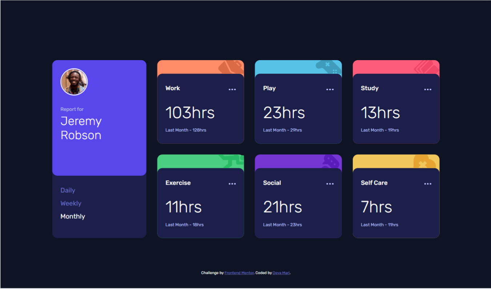
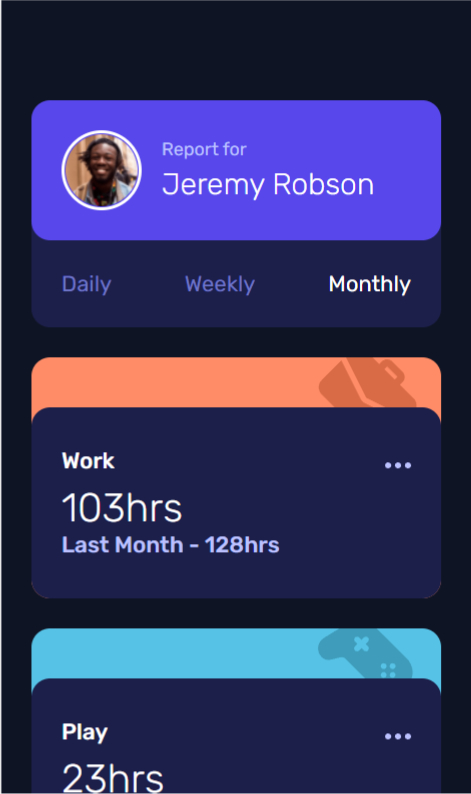

# Frontend Mentor - Time tracking dashboard solution

This is a solution to the [Time tracking dashboard challenge on Frontend Mentor](https://www.frontendmentor.io/challenges/time-tracking-dashboard-UIQ7167Jw). Frontend Mentor challenges help you improve your coding skills by building realistic projects. 

## Table of contents

- [Overview](#overview)
  - [The challenge](#the-challenge)
  - [Screenshot](#screenshot)
  - [Links](#links)
- [My process](#my-process)
  - [Built with](#built-with)
  - [What I learned](#what-i-learned)
  - [Continued development](#continued-development)
- [Author](#author)

## Overview

### The challenge

Users should be able to:

- View the optimal layout for the site depending on their device's screen size
- See hover states for all interactive elements on the page
- Switch between viewing Daily, Weekly, and Monthly stats

### Screenshot





### Links

- Repository URL: (https://github.com/Deva-Mari/Time-tracking-dashboard)
- Live Site URL: ([https://your-live-site-url.com](https://fabulous-lily-b32be7.netlify.app/))

## My process

### Built with

- Semantic HTML5 markup
- CSS custom properties
- Sass variables 
- Flexbox
- CSS Grid
- Mobile-first workflow
- [React](https://reactjs.org/) - JS library

### What I learned

- Practiced Css Grid
- Learned how to import Sass Variables
- Learned how to import images dynamically in React
- practiced switch statements and using state 

```js
  const [bgImage, setBgImage] = useState("");
  let imgName = props.title.toLowerCase().replace(" ", "-");
  import(`../assets/icon-${imgName}.svg`).then((image) =>
    setBgImage(image.default)
  );
```

### Continued development

- implement app-wide state with context or redux

## Author

- Website - [Deva Mari](https://devamari.com/)
- Frontend Mentor - [@Deva-Mari](https://www.frontendmentor.io/profile/Deva-Mari)
- GitHub- [@Deva-Mari](https://github.com/Deva-Mari)

